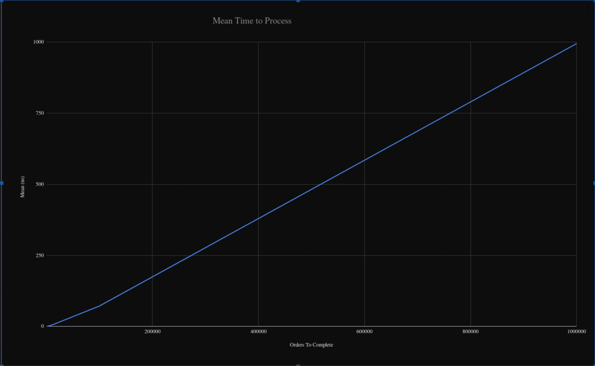

# OrderBook
High-performance Order Book Service for Trading

----

# Introduction

The purpose of this service is to keep track of pending orders in a trading system and calculate the expected price of any potential new trade by working out the volume-weighted average price.

This service has been written in C#11 with .NET 7 and gRPC for communications. It uses MongoDB as a persistent datastore and Redis for caching.

If you don't have these installed, there are docker-compose files you can use to spin the service and dependencies up locally.

They all follow the naming convention `docker-compose-X.yaml`.

| X    | Function                                                                                                                                              |
|------|-------------------------------------------------------------------------------------------------------------------------------------------------------|
| dev  | All dependencies are created with exposed ports on localhost. This is used for the API tests.                                                         | 
| perf | Runs the performance tests, you must provide it with certain `env` vars. Of particular importance is `TEST_FILE` which determines which test it runs. |
| prod | This emulates a production deployment. Dependencies are deployed on a hidden internal network and only the RPC service is exposed on localhost        |

I did create a postman collection for this, however, you can't export anything with gRPC endpoints in it for some reason.

Reflection is enabled on the service as long as `$ENVIRONMENT=Development`, so it should be pretty easy to get going with if you want to try it.

# Design Assumptions

I've designed this solution under the following (non-exhaustive) list of assumptions:

1. Reads are far more common that writes.
1. The service is internal, not exposed directly to the internet.
1. The most important hot-path is fetching the price of orders.

# Architectural Summary

The architecture of the service is simple and scaleable.

The service can be scaled horizontally through replication, and the two data-stores by sharding.

# Testing Methodology

Testing is thorough and exists at 5 different levels:

- Unit tests
- Integration tests
- API Tests
- Benchmarks
- Load/Performance Tests

Each level serves a different purpose and focusses on a different aspect of the application.

## Unit Tests

Compared to some solutions, there aren't that many of these. That's simple because the bulk of the logic for this application is contained within two areas:

- Mapping
- Calculating Prices

The majority of the rest of the application logic is basically just calling framework methods to move data around. If we were to unit test that too, it would make the solution far more inextensible.

The test-data-generator for the price calculation tests is fairly interesting. Admittedly it's probably a little overboard but I believe it's mathematically rigourous and captures a wide number of cases.

It essentially boils down to calculating random coefficients for both order and a base sale amount such that the order will always be satisfiable with a given number of orders and at a given price without essentially reimplementing the calculation used in the implementation.

## Integration Tests

The primary downstream interaction of this application is with the Mongo repository. Whilst I could have mocked this connection, I think it is more useful to verify that an actual MongoDB functions with our queries the way we would expect.

As such, I've used `EphemeralMongo6` to spin up a temporary Mongo DB which all of the tests are run against.

The primary purpose of this test level is to ensure that we can read, write and query the database as we would expect.

Admittedly, there could probably be some more tests focussed around the read caching, but I've not had time to implement them.

## API Tests

These tests verify the entire functionality of the application from a black-box perspective.

The tests can only interact with the exposed gRPC interface of the service and have no knowledge of the internal state.

These test:

- Data Validation
- Exception Tolerance
- Idempotency
- Price Calculations
- Add, Remove, and Update Orders

These tests must be run against real MongoDB and Redis instances. `docker-compose-dev.yml` stands up the relevant dependencies, all connected to localhost.

## Benchmarks

This test has one purpose, it uses `DotnetBenchmark` to evaluate the speed of the Price Calculations in the absence of any external factors.

If I were to spend some time optimising the algorithm for speed, this is the test I would use to guide me.

The actual test algorithm is essentially the same as the one used for unit testing.

## Load/Performance Tests

The benchmark is great for looking at that calculation in isolation. However, it tells us nothing about the speed of the whole system.

This is where the performance tests come in.

These tests use `k6` to place a high parallel load on the service, monitoring the average response-time.

There is a test for each of the service endpoints.

### Test Method

#### GetPrice

For this test, the MongoDB was seeded with a set of 100 orders. 

50 of these orders would be required to complete a 50,000 unit order.

This test should see significant improvements from the caching as the document is invalidated after a minute, or on a write operation.

#### OtherEndpoints

Other endpoints are simply spammed with valid requests and the time monitored, since there's no real difference in the execution complexity of any given request.

Caching will also not play much of a role in these as they are all write requests.

# Benchmark Results

| Method    | OrdersNeededToComplete |        Mean (ns) |        Error (ns) |      StdDev (ns) |
|-----------|------------------------|-----------------:|------------------:|-----------------:|
| Benchmark | 1                      |            799.1 |              2.70 |             2.53 |
| Benchmark | 100                    |         29,564.2 |             61.46 |            57.49 |
| Benchmark | 1000                   |        352,204.7 |            976.07 |           913.02 |
| Benchmark | 10000                  |      4,802,821.2 |         10,593.41 |         9,909.08 |
| Benchmark | 100000                 |     72,150,767.8 |      1,377,076.38 |     1,288,118.10 |
| Benchmark | 1000000                |    994,667,982.6 |     16,292,498.87 |    15,240,013.55 |

The results for the actual price calculation algorithm are extremely good.

Processing speeds for low values of orders process extremely fast (likely being accellerated by hardware intrinsics).

After this, the processing is still very fast and seems to be scaling linearly in O(N) time.

# Performance Testing Results

It should be noted that I ran these tests on my local machine. 

As such, the `k6` workers will have been interfering with the test, as would everything else running on my machine.

Furthermore, the latency of communicating between the Mongo and Redis servers is much lower than it might be.

It would have been better to run these on separate machines entirely, but I've not got the hardware available.

As such, I'd take the results with a grain of salt.

## Get Price Tests

| Caching Enabled   |  Avg (ms) |  Min (ms) |  Med (ms) |  Max (ms) |  p(90) (ms) |  p(95) (ms) |
|-------------------|----------:|----------:|----------:|----------:|------------:|------------:| 
| No                |     18.85 |    0.9164 |      1.64 |    499.04 |        5.22 |        8.85 | 
| Yes               |     17.18 |    0.8948 |      1.79 |    468.85 |        4.74 |        9.38 |

These tests show that there is, perhaps, a marginal improvement when caching is enabled. However, it is not a straightforward assessment to make as the median and P(95) times were slightly worse.

In order to establish whether the caching is truly effective or not, a more realistic workload would need to be devised, or real-world data gathered.

## Other Endpoints

Caching is enabled for all of these, however, this shouldn't have a significant impact as these are write operations.

There's a cycle test (add then remove) rather than a remove test because generating enough test data to handle sustained removes was impractical.

| Operation    |  Avg (ms) |  Min (ms) |  Med (ms) |  Max (ms) |  p(90) (ms) |  p(95) (ms) |
|--------------|----------:|----------:|----------:|----------:|------------:|------------:|
| Add Order    |     23.23 |    0.9596 |      3.65 |     571.0 |       10.12 |       13.06 | 
| Modify Order |     19.14 |     0.850 |     2.100 |     488.6 |       6.900 |       10.34 |
| Cycle Order  |     14.25 |     1.220 |      3.89 |    477.32 |       12.24 |       46.88 |

All of these tests execute in similarly quick times. I suspect the add order test may be slower that it should be due to the fact that the collection grows significantly as the test progresses, whereas this is not the case for each other test.

To combat this, the collection could be reset between each iteration.

## Conclusions

It is worth again remembering that these numbers are whilst significantly loaded. Individual calculation times would be much faster.

The algorithm is fairly fast, calculating prices in the low tens of milliseconds for pricing requiring a large number of orders to satisfy. 

CRUD operations complete in a similarly fast time-frame.

However, there is always room for improvement, some speed gains could likely be made at the expense of code-maintainability and safety by removing some of the mapping and validation. This is the area I would focus on first as the calculation algorithm itself seems extremely fast from the results of the benchmarking.

# Workflows

There are two workflows set up with this project.

## Continuous Integration

This workflow runs the API, Integration and Unit tests ensuring they all pass before any PR can be merged.

## "Fake" Continuous Deployment

This workflow runs on every push to `master` it "deploys" the solution and runs the performance tests. The in-pipeline `docker-compose` is a stand-in for a real deployment in this case.

# Future Developments

- The API needs authentication
- Develop a more realistic performance test suite
- Implement auto-scaling
- Optimise the hot-path further
- Investigate whether single document order lists perform better or worse than multi-document ones
- Implement an RPC streaming endpoint that can stream changes to orderlists to a persistent connection

# Notes

- If you are on Windows, make sure you have symlinks enabled in your git config or this **will not build**. No changes are needed on MacOs or Linux.
- The use of preview .NET 7 is deliberate, this is largely down to me wanting to use `required` properties and the huge [LINQ speed increases](https://devblogs.microsoft.com/dotnet/performance_improvements_in_net_7/).
